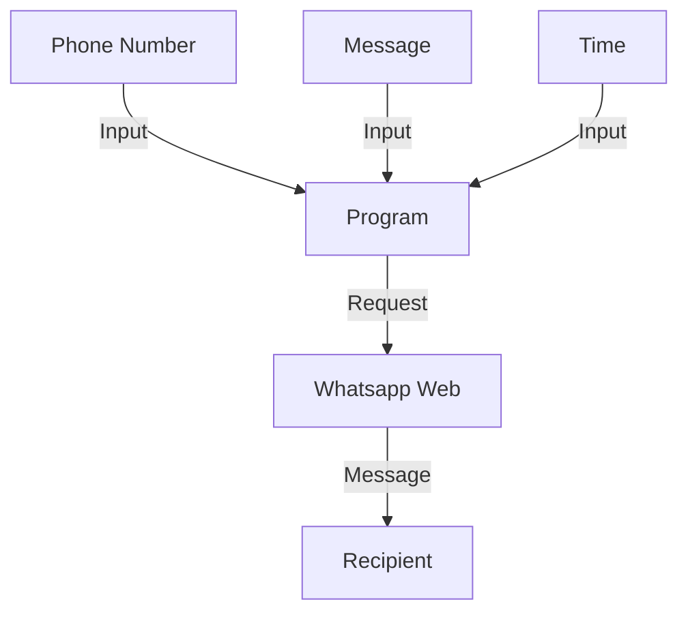

# Automate Whatsapp with Python

This project is a Python script that allows you to schedule a Whatsapp message to be sent to a recipient. Simply enter the recipient's phone number, the message you want to send, and the desired time for the message to be sent. The script will handle the rest!

## How to use?
The program will prompt you to input the `Phone Number`, `Message`, `Time`. After entering all the information, the program will schedule the message for that time. You have to enter the Time as `24 Hours` and with the format: `HH:MM`. You also need to enter the `Phone Number` with the Country Code!

## How it works?


## Software Requirements
- [Python 3.9.5](https://www.python.org/downloads/release/python-395/)
- An IDE for editing code:
   - [Pycharm Community Edition](https://www.jetbrains.com/pycharm/download)
   - [Visual Studio Code](https://code.visualstudio.com/download)
   - [Spyder](https://www.spyder-ide.org/#section-download)
   - others...
   
## Module Requirement
| Module | Version | `pip` Command |
| :--: | :-----: | :---: |
| PyAutoGUI | 0.9.53 | `pip install PyAutoGUI==0.9.53` |


## Troubleshooting

### Errors

#### **Error - 1**
```
exceptions.CountryCodeException: Country Code Missing in Phone Number!
```

**Solution**

This error comes up when you didn't enter the Country Code before the Number. Use the Country Code before the Phone Number, and this is how you will solve this error!

##

#### **Error - 2**
```
exceptions.CallTimeException: Call Time must be Greater than Wait Time as WhatsApp Web takes some Time to Load!
```

**Solution**

This shows when the wait time is Greater than the Remaining Time to send!

##

#### **Error - 3**
```
exceptions.WaitTimeException: Wait Time must be Greater than 7 Seconds!
```

**Solution**

This error shows up when the `wait_time` is less than `7` seconds.

##

#### **Error - 4**
```
exceptions.WhatsAppNotFoundException: Seems the WhatsApp Web Window was closed or moved to another Tab!
```

**Solution**

This error shows up when you close or move to another tab in the Browser and the Program unable to find the text box. By not doing anything when the window open will solve this issue!

##

#### **Error - 5**
```
exceptions.InvalidPhoneNumber: Invalid Phone Number.
```

**Solution**

This error comes in when you enter a wrong Phone Number. Correcting the phone number will solve this error!

##

#### **Error - 6**
```
exceptions.UserInputException: Invalid Choice! Answer must be "Yes" or "No".
```

**Solution**

This error shows up when you didn't enter "Yes" or "No" in the Input Prompt.

The Prompt: 
> ```
> Do you want to send the message instantly? Options: Yes/No
> >>>
> ```

##

#### **Error - 7**
```
exceptions.UserInputException: Unable to identify Hour, Minute and Second! Please use the format: HH:MM:SS (Seconds are Optional)
```

**Solution**

This error shows up when the program don't able to get the Desired Time (Hour, Minute and Second[Optional]) to send the message from the Input Prompt. By maintaining the format: `HH:MM:SS`, you'll able to solve the issue!

The Prompt:
> ```
> Enter the desired time in 24 Hours. Format: HH:MM:SS (Seconds are Optional)
> >>>
> ```

### Warnings

#### **Warning - 1**
```
Warning: Invalid Time Format!
```

**Solution**

This error said what's wrong inside the message. To fix this error you should just recheck the Time you've entered. Hours should be within `0 - 24` and minutes should be within `0 - 60`.

##

#### **Warning - 2**
```
Warning: System not supported!
```

**Solution**

The Window Closing system (`tab_close` parameter) only works in `Windows`, `Linux` and `Darwin`. This error comes in when the Program fails to close the windows for the System Requirement!


#

Thank you! You've read all the instructions here!

By the way, a Star to this Repository would be awesome!

> 31 January, 2023/Tahsin