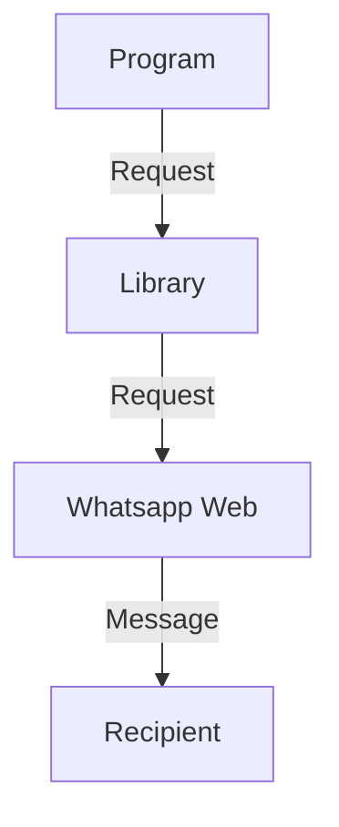

# Automate Whatsapp with Python

This project is a Python script that allows you to schedule a Whatsapp message to be sent to a recipient. Simply enter the recipient's phone number, the message you want to send, and the desired time for the message to be sent. The script will handle the rest!

## How to use?
The program will prompt you to input the `Phone Number`, `Message`, `Time`. After entering all the information, the program will schedule the message for that time. You have to enter the Time as `24 Hours` and with the format: `HH:MM`. You also need to enter the `Phone Number` with the Country Code!

## How it works?


## Software Requirements
- [Python 3.9.5](https://www.python.org/downloads/release/python-395/)
- An IDE for editing code:
   - [Pycharm Community Edition](https://www.jetbrains.com/pycharm/download)
   - [Visual Studio Code](https://code.visualstudio.com/download)
   - [Spyder](https://www.spyder-ide.org/#section-download)
   - others...
   
## Module Requirement
| Module | Version | `pip` Command |
| :--: | :-----: | :---: |
| pywhatkit | 5.4 | `pip install pywhatkit==5.4` |

## `pywhatkit.sendwhatmsg` Arguments
| Parameter | Description | Supported Type | Default | Example |
| :--: | :-- | :---: | :---: | :---: |
| phone_no | Recipient Number | str | Required | +8801234567890 |
| message | Message that will be sent | str | Required | Hello |
| time_hour | The Hour when the Message will be sent | int | Required | 18 |
| time_min | The Minute when the Message will be sent | int | Required | 46 |
| wait_time | The Time will be waited after the window open | int | 15 | 10 |
| tab_close | If the Tab will be closed after sending Message | bool | False | True |
| close_time |  | int | 3 | 1 |


## Troubleshooting

### Pywhatkit Errors

#### **Error**
```py
pywhatkit.core.exceptions.CountryCodeException: Country Code Missing in Phone Number!
```

**Solution**

This Error come up when you didn't enter the Country Code before the Number. Use the Country Code before the Phone Number, and this is how you will solve this error!

##

#### **Error**
```py
Warning: Invalid Time Format!
```

**Solution**

This error said what's wrong inside the message. To fix this Error you should just recheck the Time you've entered. Hours should be within `0 - 24` and Minutes should be within `0 - 60`.

##

#### **Error**
```py
pywhatkit.core.exceptions.CallTimeException: Call Time must be Greater than Wait Time as WhatsApp Web takes some Time to Load!
```

**Solution**

This shows when the time, you've entered is already past or less that 10/7 seconds

##

#### **Error**
```py
ValueError: sleep length must be non-negative
```

**Solution**

This error come up when you used the `wait_time` which is lesser than `7` seconds.

**NOTE**: *This Solution is self-made. According to some experiments it work!*
